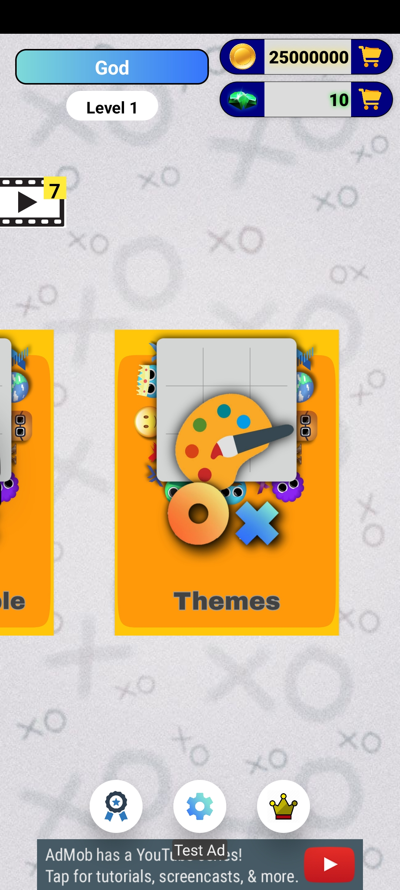

# 🎮 TicTacToe Android Game

## Overview

TicTacToe is a feature-rich multiplayer game built using Android Studio and Java. The game offers a variety of modes, including online multiplayer, story mode, AI practice, and 2-player offline matches. It supports in-game purchases of coins and gems via Google Play and includes Google Play Games integration for achievements and leaderboards. Additionally, it is monetizable through AdMob (not in production yet) and leverages Firebase for real-time multiplayer functionality.

## 🌟 Features

- **🎮 Multiplayer Modes:**
  - **🌐 Online Multiplayer (1v1)**: Play one-on-one matches against friends or random opponents. Bet coins on each game for added excitement!
  - **👥 Private 2-Player Table**: Play a private game with a friend on the same device.
- **🕹️ Single-Player Modes:**

  - **🗺️ Story Mode**: Embark on a journey with 204 levels, each with increasing difficulty.
  - **🤖 AI Practice**: Hone your skills by playing against a challenging AI with different difficulty levels.

- **🎨 Customization:**
  - **🎨 Themes**: Unlock and purchase 10 unique themes using in-game coins to personalize the look and feel of your game.
- **💰 Economy:**
  - **💰 Coins & 💎 Gems**: Earn, purchase, and bet coins and gems. Coins can be earned in-game or purchased through Google In-App Purchases. Gems are premium currency used for special items.
- **🏆 Google Play Games Integration:**

  - **🏆 Achievements**: Unlock achievements as you progress through the game.
  - **🥇 Leaderboards**: Compete with players globally and see who tops the TicTacToe rankings.

- **☁️ Firebase Integration**:

  - **🔗 Real-time Multiplayer**: Firebase ensures smooth and real-time online multiplayer gameplay.

- **📱 Monetization (AdMob)**:
  - **📱 AdMob Integration**: Currently not in production, but the game includes the ability to monetize using AdMob ads.

## 📸 Screenshots

### 1. **🌐 Online Multiplayer (1v1)**

### 2. **🗺️ Story Mode**

### 3. **🤖 AI Practice Mode**

### 4. **🕹️ Private Table**

### 5. **🎨 Themes**

### 6. **🏆 Achievements**

### 7. **🥇 Leaderboard**

### 8. **🛒 In-App Purchase Store**

### 9. **📱 AdMob Integration**

### 10. **🎮 Google Play Games Login**

### 11. **⚙️ Settings**

## 🛠️ Technologies & Tools

- **👨‍💻 Language**:
  
- **🛠️ IDE**:
  
- **☁️ Realtime Databases**:
  
- **🎮 Leaderboard & Achievements**:
  
- **🛒 Google In-App Purchases**:
  
- **📱 Monetization**:
  
- **🔄 Version Control**:
  

## 🎯 How to Play

1. **📲 Download and Install**: Install it from the Google Play Store (coming soon).
2. **🎮 Choose Your Mode**: Select from story mode, multiplayer, AI practice, or offline 2-player mode.
3. **💰 Earn & Purchase Coins**: Win coins in multiplayer matches or buy them in the in-game store.
4. **🎨 Unlock Themes**: Customize the game with different themes purchased using coins.
5. **🥇 Climb the Leaderboards**: Play online to earn ranking points and see how you rank globally!

## 🚀 Future Plans

- **📱 AdMob Monetization**: Enable ads in the game for passive income.
- **➕ Additional Levels**: Expand the story mode with more levels.
- **🏆 Tournaments**: Introduce tournaments for multiplayer mode with larger coin rewards.
- **🎨 More Themes**: Add additional customizable themes and avatars.

## 🤝 How to Contribute

1. Fork the repository.
2. Create a new branch for your feature or bug fix.
3. Submit a pull request with a detailed description of the changes made.

## 📄 License

This project is licensed to be used by only [@itsVaibhavSharma](https://github.com/itsVaibhavSharma).
